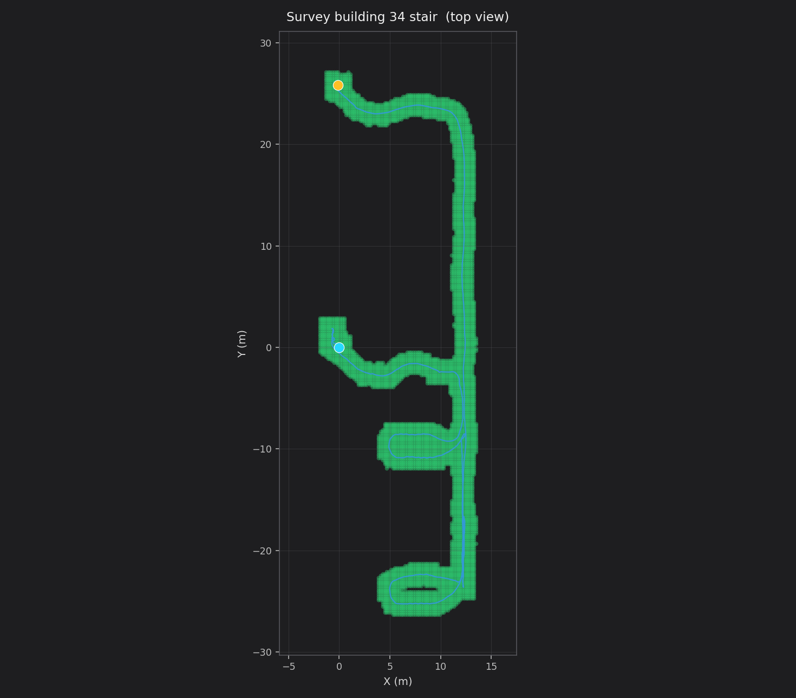
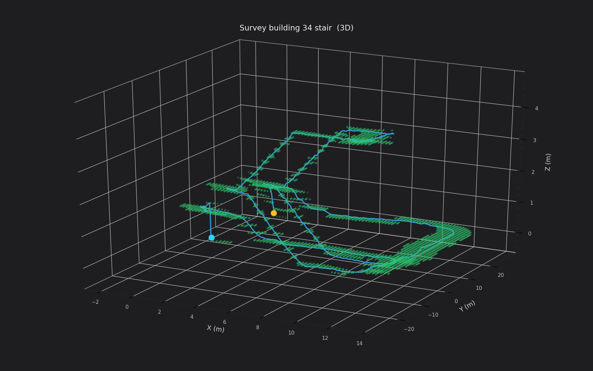

# map_for_plan

工程化实现 3D 导航中的全局规划：把一条 **TUM 轨迹**膨胀成单层 FREE 体素，作为三维规划搜索空间。对点云质量不做要求，稳定但有局限性；不读激光、不裁墙（避免把行人残影挖成空洞）。

输入只要一份 TUM：`t x y z [qx qy qz qw]`。

## 效果

绿带是单层可通行体素，蓝线是轨迹，青/橙点是起终点。仓库只放截图，不上传 `output/` 里的点云和轨迹数据。

测绘学院 34 楼梯：





## 依赖

- ROS Noetic：`rospy`、`rviz`、`nav_msgs`、`sensor_msgs`、`visualization_msgs`
- Python 3：`numpy`

地图生成和 A* 规划不必编译。RViz 里点选三维起终点需要先编译插件（交互与 dog_nav_3d 的 3D Pose Estimate / 3D Nav Goal 相同：点地图、拖朝向、滚轮改高度）。

```bash
source /opt/ros/noetic/setup.bash
source /path/to/map_for_plan/setup.bash
./scripts/build_rviz_plugins.sh   # 只要做一次
source /path/to/map_for_plan/setup.bash
```

未编译插件时，仍可用 RViz 自带的 **2D Pose Estimate** / **2D Nav Goal**；规划器会按 XY 吸附到单层可通行体素。

## 一键：生成 + RViz

```bash
./scripts/run_from_tum.sh /path/to/traj.tum
```

默认写到 `output/<文件名>_free.pcd`、`_path.tum`、`_plan.json`，并打开 RViz。

指定输出前缀：

```bash
./scripts/run_from_tum.sh /path/to/traj.tum /tmp/my_plan
```

## 分两步

```bash
python3 scripts/tum_to_plan_map.py --traj /path/to/traj.tum --output-prefix output/demo

roslaunch map_for_plan plan.launch \
  meta:=/path/to/map_for_plan/output/demo_plan.json
```

只看地图、不规划：

```bash
roslaunch map_for_plan visualize.launch \
  meta:=/path/to/map_for_plan/output/demo_plan.json
```

可选参数：`--resolution 0.20`（体素边长，米）、`--half-width 1.0`（左右半宽，米）、`--pose-stride 0.10`（轨迹抽稀间距，米）。

## RViz 全局规划

1. 工具栏选 **3D Pose Estimate**（快捷键 `p`）：点绿色地图，拖动设朝向，滚轮改高度，松开即起点。
2. 再选 **3D Nav Goal**（快捷键 `g`）：同样方式点终点，松开后立刻规划。
3. 品红粗线是全局路径，青/粉球是吸附后的起终点。

话题：`/initialpose`、`/move_base_simple/goal`、`/plan_map/global_path`。

规划只在单层 FREE 体素上做 8 邻域 A*，相邻格高度差超过 `max_step`（默认 0.80 m）不连通。代价偏好走廊中央（净空大、靠近采集中线），贴边格子更贵；`center_weight` 越大越居中。

## 输出

| 文件 | 含义 |
|---|---|
| `*_free.pcd` | 单层可通行体素，规划只在这些格子里搜 |
| `*_path.tum` | 抽稀后的轨迹 |
| `*_plan.json` | 路径和参数，给 RViz 用 |

RViz：绿块是规划地图，淡蓝线是采集轨迹，品红线是本次全局规划。话题：`/plan_map/free`、`/plan_map/path`、`/plan_map/global_path`。

## 做法

沿轨迹切向取水平左向，左右各膨胀 `half-width`，高度取轨迹高度，同一 XY 只留一层。
