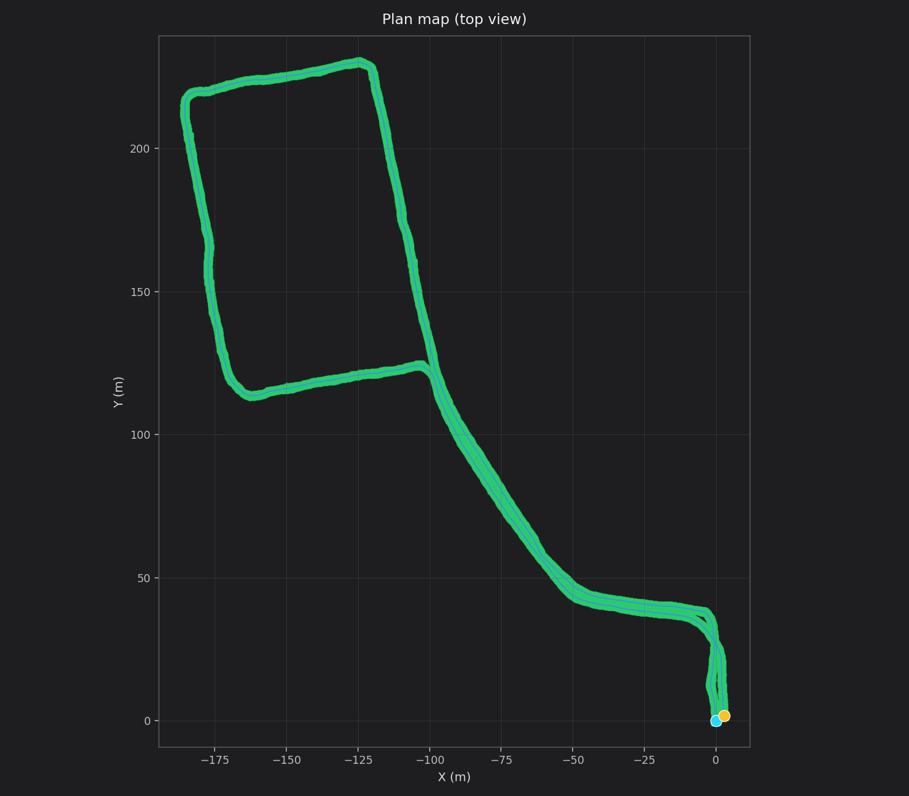
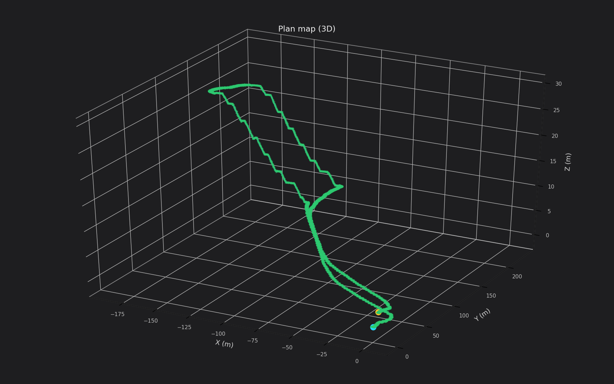

# map_for_plan

工程化实现 3D 导航中的全局规划：把一条 **TUM 轨迹**膨胀成单层 FREE 体素，作为三维规划搜索空间。对点云质量不做要求，稳定但有局限性；不读激光、不裁墙（避免把行人残影挖成空洞）。

输入只要一份 TUM：`t x y z [qx qy qz qw]`。

## 效果

绿带是单层可通行体素，蓝线是轨迹，青/橙点是起终点。仓库只放截图，不上传 `output/` 里的点云和轨迹数据。





## 依赖

- ROS Noetic：`rospy`、`rviz`、`nav_msgs`、`sensor_msgs`、`visualization_msgs`
- Python 3：`numpy`

不必 `catkin_make`。把本目录挂到 `ROS_PACKAGE_PATH` 即可。

```bash
source /opt/ros/noetic/setup.bash
source /path/to/map_for_plan/setup.bash
```

## 一键：生成 + RViz

```bash
./scripts/run_from_tum.sh /path/to/traj.tum
```

默认写到 `output/<文件名>_free.pcd`、`_path.tum`、`_plan.json`，并打开 RViz。

指定输出前缀：

```bash
./scripts/run_from_tum.sh /path/to/traj.tum /tmp/my_plan
```

## 分两步

```bash
python3 scripts/tum_to_plan_map.py --traj /path/to/traj.tum --output-prefix output/demo

roslaunch map_for_plan visualize.launch \
  meta:=/path/to/map_for_plan/output/demo_plan.json
```

可选参数：`--resolution 0.20`（体素边长，米）、`--half-width 1.0`（左右半宽，米）、`--pose-stride 0.10`（轨迹抽稀间距，米）。

## 输出

| 文件 | 含义 |
|---|---|
| `*_free.pcd` | 单层可通行体素，规划只在这些格子里搜 |
| `*_path.tum` | 抽稀后的轨迹 |
| `*_plan.json` | 路径和参数，给 RViz 用 |

RViz：绿块是规划地图，蓝线是轨迹，青/橙球是起终点。话题：`/plan_map/free`、`/plan_map/path`。

## 做法

沿轨迹切向取水平左向，左右各膨胀 `half-width`，高度取轨迹高度，同一 XY 只留一层。
